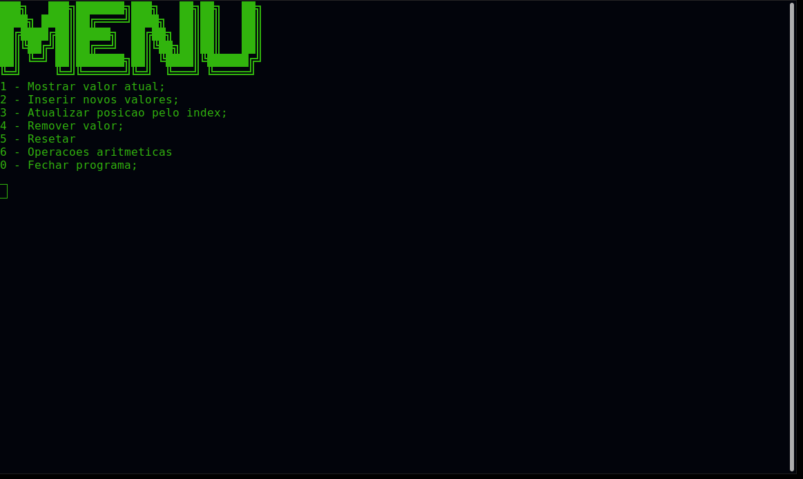

# crud-02-arrays
> CRUD simples sem o auxílio de banco de dados feito para análise e decomposição de arrays.

### Descrição
Um CRUD em si tem a função principal de realizar uma tarefa específica ou diversas tarefas que lidam com uma determinada quantidade de dados. Neste caso, os dados lidados pelo CRUD em questão são vetores unidimensionais (popularmente conhecidos como **arrays**). Em sua essência, arrays são coleções de dados de tipos variados que lidam de formas diferentes de acordo com a aplicação e com seu tamanho, sendo este pré-definido ou não.

As operações submetidas no atual código são a de adição de valores, atualização de um valor por um index específico, remoção do último valor e um processo no qual todo o vetor é resetado, voltando para seu estado original. Ademais, há uma função na qual são realizadas operações aritméticas: soma, subtração, multiplicação e divisão. Trata-se de uma aplicação bastante simples focadas no comportamento dos arrays e como é possível manipulá-los.

Em relação à linguagem de programação, todo o programa fora implementado na linguagem **Julia**, uma linguagem multiparadigma e dinâmica cujo foco está na análise numérica e na Computação Científica. O objetivo de utilizá-la fora sua rapidez e o modo como ela trabalha com uma quantidade muito precisa de dados de acordo com sua definição de tipos ou não.

### Como executar
Como pré-requesito para rodar o código, é preciso primeiro instalar a linguagem em seu [site oficial](https://julialang.org/downloads/).
